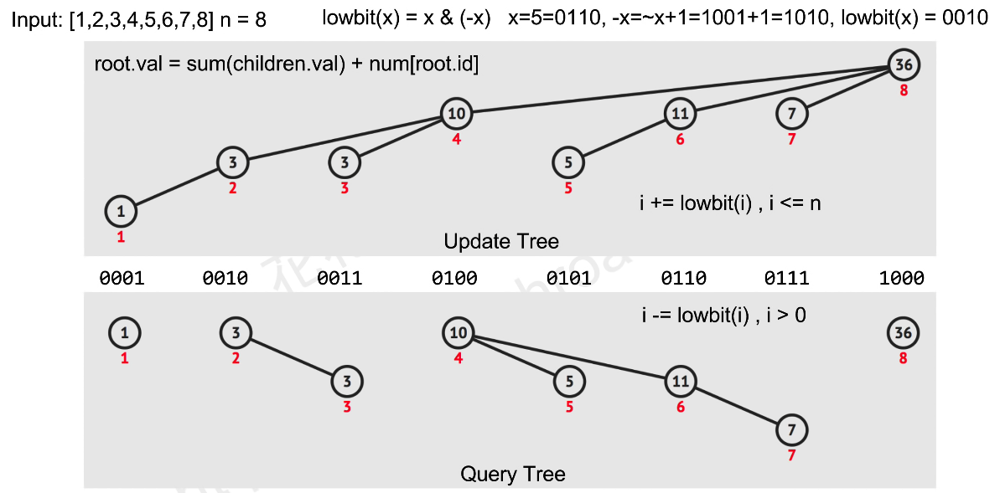

# Binary Indexed Tree(Fenwick Tree)

## Motivation

Fenwick tree is proposed to solve the prefix sum problem.
The idea is to **store partial sum** in each node and get total sum by traversing the tree from leaf to root.

The tree has a height of log(n).

Query: O(log(n))
Update: O(log(n))



## Template

``` py
l = max(A) or len(A) # depends
s = [0] * len(l+1)

def update(i, delta):
    # Note that in some questions delta is always 1!!!!!!!!!!!!!!!!!!
    while i<l:
        s[i] += delta
        i += i & -i

def get(i):
    ans = 0
    while i>0:
        ans += c[i]
        i -= i & -i

ans = 0
for i, a in enumerate(A):
    `logic`
    update(a)
return ans
```

## Reference

1. [花花酱 Fenwick Tree / Binary Indexed Tree - 刷题找工作 SP3](https://www.youtube.com/watch?v=WbafSgetDDk)
