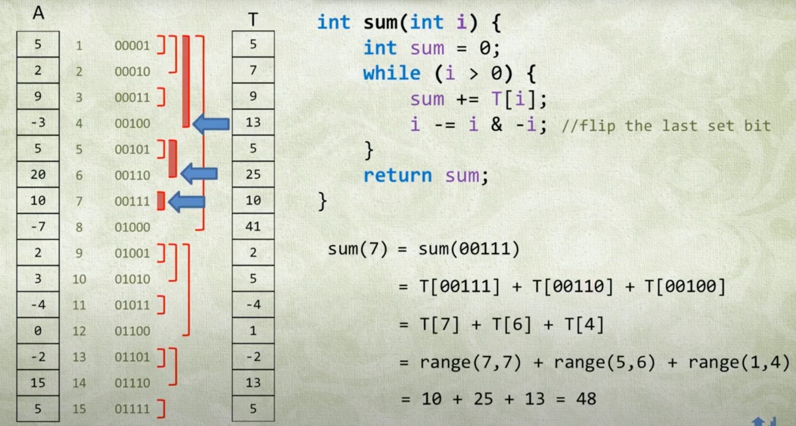

# Binary Indexed Tree(Fenwick Tree)

## Motivation

Fenwick tree is proposed to solve the prefix sum problem, **especially when the a change is made to the array**.
The idea is to **store partial sum** in each node and get total sum by traversing the tree from leaf to root.1
The `get(i)` function mainly sums up the nodes by **flipping the last set bit**. For example, `get(7)=get(00111)=BIT[00111]+BIT[00110]+BIT[01000]=BIT[7]+BIT[6]+BIT[4]`

Since the tree has a height of log(n), time complexity of `Get` is O(log(n)) and `Update` is O(log(n)).

In practice, there are a few caveats:

1. Get the element count less than current element `x`: `bit.get(x-1)`
2. Get the element count larger than current element `x`: `i-bit.get(x)`



## Template

``` py
class BIT:
    def __init__(self, n):
        self.A = [0] * (n+1)
    
    def get(self, k):
        sm = 0
        k += 1
        while k:
            sm += self.A[k]
            k -= k & -k
        return sm
    
    def add(self, k, x):
        k += 1
        while k<len(self.A):
            self.A[k] += x
            k += k & -k
```

## Reference

1. [花花酱 Fenwick Tree / Binary Indexed Tree - 刷题找工作 SP3](https://www.youtube.com/watch?v=WbafSgetDDk)
2. [Fenwick Tree (Binary Index Tree) - Quick Tutorial and Source Code Explanation](https://www.youtube.com/watch?v=uSFzHCZ4E-8)