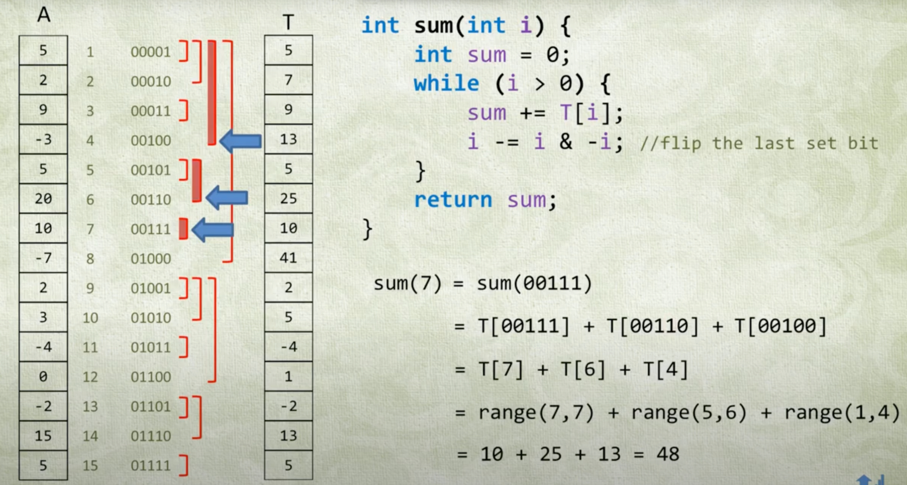

---
tags:
  - leetcode
  - advanced
  - moc
---

# Binary Indexed Tree (Fenwick Tree)

## When to Use

| Problem Signal | Technique |
|---|---|
| Range sum queries + point updates (dynamic array) | BIT (point update) |
| Range updates + point queries (dynamic array) | BIT (range update with difference array) |
| Count inversions / smaller elements after self | BIT + coordinate compression |
| Count triplets with ordering constraints | BIT with prefix/suffix counting |
| 2D range sum queries + updates | 2D BIT |
| Need O(log n) updates AND queries | BIT or Segment Tree |

### BIT vs Segment Tree vs Prefix Sum

| | Prefix Sum | BIT | Segment Tree |
|---|---|---|---|
| Static range query | O(1) | O(log n) | O(log n) |
| Point update | O(n) rebuild | O(log n) | O(log n) |
| Range update | O(1) with diff array | O(log n) per endpoint | O(log n) with lazy prop |
| Space | O(n) | O(n) | O(4n) |
| Code complexity | Trivial | Low | Medium |
| Supports arbitrary range ops (min, gcd, etc) | No | No | Yes |

**Rule of thumb:**
- Static array → Prefix sum
- Point updates, range queries → BIT
- Range updates, range queries → Segment Tree or BIT with difference array
- Non-sum operations (min/max/gcd) → Segment Tree

## Core Idea

Binary Indexed Tree (Fenwick Tree) efficiently supports point updates and prefix queries in O(log n) time.

The key insight: each index `i` stores the sum of `i & -i` elements ending at `i`. The tree structure is implicit, defined by bit manipulation.

- `sum(i)` computes prefix sum by **flipping the last set bit** and moving left
- `add(i, delta)` updates by **adding the last set bit** and moving right

Example: `sum(7) = BIT[7] + BIT[6] + BIT[4]` (binary: 111 → 110 → 100)



Time complexity: O(log n) for both `sum` and `add`.

## Template: Point Update, Range Query

The standard BIT supports O(log n) point updates and O(log n) prefix queries. Range queries are computed as `sum(r) - sum(l-1)`.

```py
class BIT:
    def __init__(self, n):
        self.A = [0] * (n + 1)

    def sum(self, k):
        """Prefix sum: A[0..k] inclusive"""
        sm = 0
        k += 1
        while k:
            sm += self.A[k]
            k -= k & -k
        return sm

    def add(self, k, x):
        """Add x to A[k]"""
        k += 1
        while k < len(self.A):
            self.A[k] += x
            k += k & -k
```

### Usage patterns

```py
# Range sum [l, r]
bit.sum(r) - bit.sum(l - 1)

# Point update: set A[k] = new_val (need to track original array)
bit.add(k, new_val - A[k])
A[k] = new_val

# Count elements < x (for coordinate-compressed values)
bit.sum(x - 1)

# Count elements > x (where i is current position)
i - bit.sum(x)
```

## Template: Range Update, Point Query

Use BIT with difference array to support O(log n) range updates and O(log n) point queries.

Key insight: maintain `diff[i] = A[i] - A[i-1]` in the BIT. Then `A[k] = sum(diff[0..k])`.

```py
class BIT:
    def __init__(self, n):
        self.A = [0] * (n + 1)

    def sum(self, k):
        sm = 0
        k += 1
        while k:
            sm += self.A[k]
            k -= k & -k
        return sm

    def add(self, k, x):
        k += 1
        while k < len(self.A):
            self.A[k] += x
            k += k & -k

# Range update: add delta to A[l..r]
def range_add(bit, l, r, delta):
    bit.add(l, delta)
    bit.add(r + 1, -delta)

# Point query: get A[k]
def point_query(bit, k):
    return bit.sum(k)
```

## 2D Binary Indexed Tree

For 2D range sum queries with updates. Each operation is O(log m * log n).

```py
class BIT2D:
    def __init__(self, m, n):
        self.A = [[0] * (n + 1) for _ in range(m + 1)]

    def sum(self, r, c):
        """Sum of submatrix [0..r][0..c]"""
        sm = 0
        r += 1
        while r:
            c_tmp = c + 1
            while c_tmp:
                sm += self.A[r][c_tmp]
                c_tmp -= c_tmp & -c_tmp
            r -= r & -r
        return sm

    def add(self, r, c, x):
        """Add x to A[r][c]"""
        r += 1
        while r < len(self.A):
            c_tmp = c + 1
            while c_tmp < len(self.A[0]):
                self.A[r][c_tmp] += x
                c_tmp += c_tmp & -c_tmp
            r += r & -r

# Range sum query [r1..r2][c1..c2]
bit.sum(r2, c2) - bit.sum(r2, c1 - 1) - bit.sum(r1 - 1, c2) + bit.sum(r1 - 1, c1 - 1)
```

## Common Patterns

### Pattern 1: Coordinate Compression + Inversion Counting

LC 315, 1649, 775

When values are large (up to 10^9) but count is small (up to 10^5), compress values to indices.

```py
# Compress values to dense indices
mp = {x: i for i, x in enumerate(sorted(set(A)))}
bit = BIT(len(mp))

# Process elements (often in reverse)
ans = []
for x in reversed(A):
    # Count smaller elements
    ans.append(bit.sum(mp[x] - 1))
    # Add current element
    bit.add(mp[x], 1)
```

Key insight: BIT stores frequency of each value. Query prefix sum to count how many elements are smaller.

### Pattern 2: Triplet Counting with Ordering Constraints

LC 1395, 2179

Count triplets `(i, j, k)` where `i < j < k` and values satisfy some ordering constraint (e.g., `A[i] < A[j] < A[k]`).

```py
# For middle element at position j, count:
# - left[j] = elements in A[0..j-1] that are smaller
# - right[j] = elements in A[j+1..n-1] that are larger
# Answer += left[j] * right[j]

bit = BIT(n)
for i, x in enumerate(B):
    x = map_to_A_index[x]
    left = bit.sum(x)  # count of smaller elements seen so far
    right = (n - 1 - x) - (bit.sum(n - 1) - left)  # larger elements remaining
    ans += left * right
    bit.add(x, 1)
```

### Pattern 3: Dynamic Range Sum Query

LC 307

Simple application: maintain BIT for array, update points, query ranges.

```py
class NumArray:
    def __init__(self, A):
        self.A = A
        self.bit = BIT(len(A))
        for i, x in enumerate(A):
            self.bit.add(i, x)

    def update(self, k, x):
        self.bit.add(k, x - self.A[k])
        self.A[k] = x

    def sumRange(self, l, r):
        return self.bit.sum(r) - self.bit.sum(l - 1)
```

## LeetCode Problems

| Problem | Difficulty | Pattern |
|---|---|---|
| [307. Range Sum Query - Mutable](https://leetcode.com/problems/range-sum-query-mutable/) | L2 | Dynamic range sum (basic) |
| [315. Count of Smaller Numbers After Self](https://leetcode.com/problems/count-of-smaller-numbers-after-self/) | L1 | Coordinate compression + inversion |
| [775. Global and Local Inversions](https://leetcode.com/problems/global-and-local-inversions/) | L2 | Inversion counting |
| [1395. Count Number of Teams](https://leetcode.com/problems/count-number-of-teams/) | L3 | Triplet counting |
| [1649. Create Sorted Array through Instructions](https://leetcode.com/problems/create-sorted-array-through-instructions/) | L1 | Online inversion counting |
| [2179. Count Good Triplets in an Array](https://leetcode.com/problems/count-good-triplets-in-an-array/) | L3 | Triplet with mapping |
| [2193. Minimum Number of Moves to Make Palindrome](https://leetcode.com/problems/minimum-number-of-moves-to-make-palindrome/) | L3 | Dynamic inversion counting |

## Key Insights

1. **Index convention**: BIT is 1-indexed internally. Always do `k += 1` before operations and use `n+1` size.

2. **Coordinate compression**: For large values (up to 10^9), compress to small indices (0 to k-1). Use `mp = {x: i for i, x in enumerate(sorted(set(A)))}`.

3. **Count queries**:
   - Elements < x: `bit.sum(x - 1)`
   - Elements > x: `i - bit.sum(x)` where i is current position
   - Elements = x: `bit.sum(x) - bit.sum(x - 1)`

4. **Range to prefix**: Any range query `[l, r]` becomes `sum(r) - sum(l - 1)`. This is why BIT focuses on prefix sums.

5. **Difference array trick**: To support range updates, maintain `diff[i]` in BIT instead of values. Point query becomes prefix sum of diff array.

6. **2D extension**: Each dimension adds a factor of log(n) to complexity. 2D BIT is O(log m * log n) per operation.

7. **Offline vs online**: If all queries are known upfront, consider sorting + sweep line. BIT shines for online queries.

## Reference

1. [花花酱 Fenwick Tree / Binary Indexed Tree - 刷题找工作 SP3](https://www.youtube.com/watch?v=WbafSgetDDk)
2. [Fenwick Tree (Binary Index Tree) - Quick Tutorial and Source Code Explanation](https://www.youtube.com/watch?v=uSFzHCZ4E-8)
